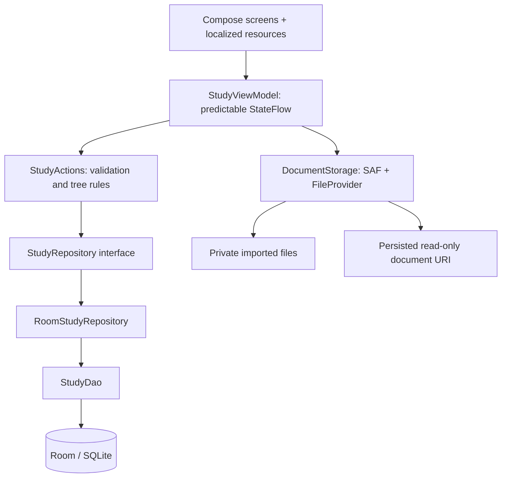
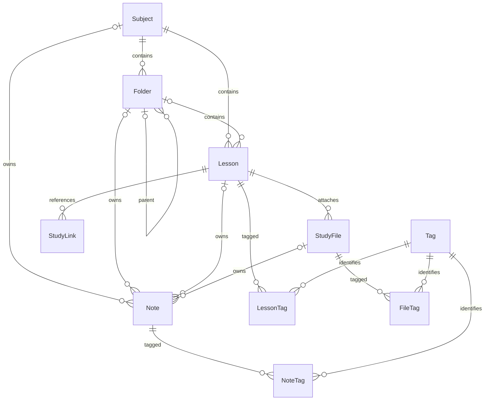
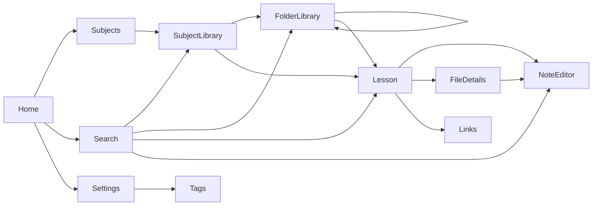

# NAGEEB STUDY OS — V1 engineering specification

## Release boundary
Native Android, Kotlin/Compose/Material 3/Room. All core data and settings are local. No INTERNET permission, network client, AI, ads, account, server or cloud sync. External HTTP(S) links and cloud-backed document providers may require connectivity outside the app; imported local content does not. Planner, Focus and Analytics are explicitly unavailable V2 destinations, not simulated features.

## Architecture / data flow

Application-owned dependency container, constructor injection, one database/repository per process. Domain uses no Android UI classes. Screens never access DAO. Structured coroutine operations expose loading, error and success states. No destructive database migration. Schema exported and versioned.

## ERD

## Schema contract
Each content entity uses a UUID string primary key independent of titles or paths. Content has createdAt/updatedAt epoch milliseconds. Subject: title, accent, position. Folder: subjectId, nullable parentId, title, position; composite FK (subjectId,parentId) -> Folder(subjectId,id) prevents cross-subject parents. Lesson: subjectId, nullable folderId, title, position, status and three independent integer progress values 0..100; composite folder FK. StudyFile: lessonId, title, location, MIME, size, storageType LINKED/IMPORTED. StudyLink: lessonId, title, URL, type. Note: exactly one non-null owner (subjectId/folderId/lessonId/fileId), title, body. Tag: unique case-folded key, title. Tag joins have independent IDs plus unique pair indexes. AppSetting: key PK, value, updatedAt. PendingDeletion: ID/path, durable internal-file cleanup queue. Indexed FKs and ordering columns. Cascades remove owned content and joins, never tag definitions; no code deletes a linked original.

## Hierarchy invariants
Unbounded adjacency-list depth; ancestor traversal is iterative, visited-set guarded. Move cannot target itself or any descendant and is limited to the same subject in V1. Deletions are confirmed and transactional. Imported paths are queued in the same transaction as cascaded record deletion, then removed from internal storage. Interrupted cleanup retries on restart. Sibling reorder is transactional. Root folders and lessons supported. Folder breadcrumbs and move-tree expansion operate on IDs.

## Navigation / screen map

Home shows actual recent content only. Quick Add infers the current subject, folder and lesson; unavailable operations are not offered. Search is a repository-bound UNION of seven indexed entity tables, escaped LIKE matching, bounded results. This boundary can change to FTS/paging without changing screen navigation. Empty databases remain empty; no sample content is seeded.

## Main flows
Create subject → create folder → nested folder → lesson → SAF attach/import → add note/link → create/attach tag → global search → open result. Settings persist language and system/light/dark appearance. Settings are in Room to avoid a second persistence subsystem. Arabic resources, explicit RTL/LTR and runtime configuration share the persisted locale setting.

## File strategy
ACTION_OPEN_DOCUMENT read grants only. LINKED saves content URI and takes persistable permission before committing a record; permission failure is visible. IMPORTED streams into a private temporary file with an 8 KiB copy buffer, then atomically renames; no full-file buffering. Failed record insertion removes its newly imported file. FileProvider grants temporary read permission to external viewers; no built-in media player. Removal never calls DocumentsContract.deleteDocument or deletes a linked URI. Confirmed imported deletion removes only the app-owned copy. A durable pending-deletion queue recovers interrupted cleanup. No broad storage permissions. External viewer availability, revoked grants, unavailable providers and missing files are user-visible errors. SAF grant count is finite; imported copies avoid dependence on grants. Imported files are lost on app uninstall; local backup/export is outside this candidate's scope.

## Errors and performance
Typed validation failures are localized at presentation boundary. Database/open/query failures show retry/error state; coroutine cancellation is never swallowed. Operations serialize through a mutex to prevent double-submit races. Lists use stable ID keys and LazyColumn. File IO and database work run off the main thread. Search is debounced, cancels stale work and limits results; search includes note bodies but regular lists do not. No simulated progress. Large-library stress testing and real-device SAF tests are release gates, not inferred from compilation.

## Verification policy
Run pure-domain tests and Robolectric SQLite/Room integration tests. Device-only acceptance, lifecycle, accessibility, visual screenshots and external-provider SAF behavior must be labeled NOT RUN if no device/emulator exists. Successful JVM tests or an APK build do not prove the full acceptance flow. V1 cannot be called stable until remaining gates pass.
